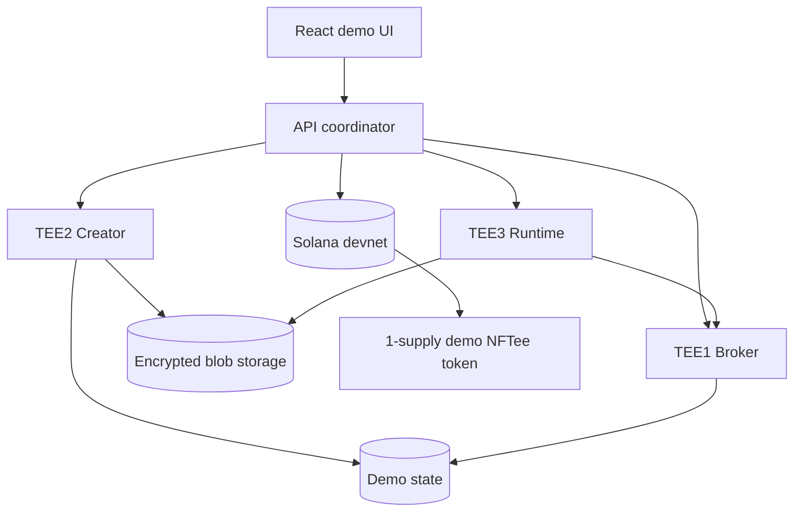
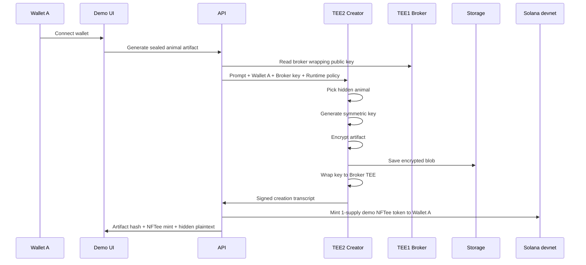
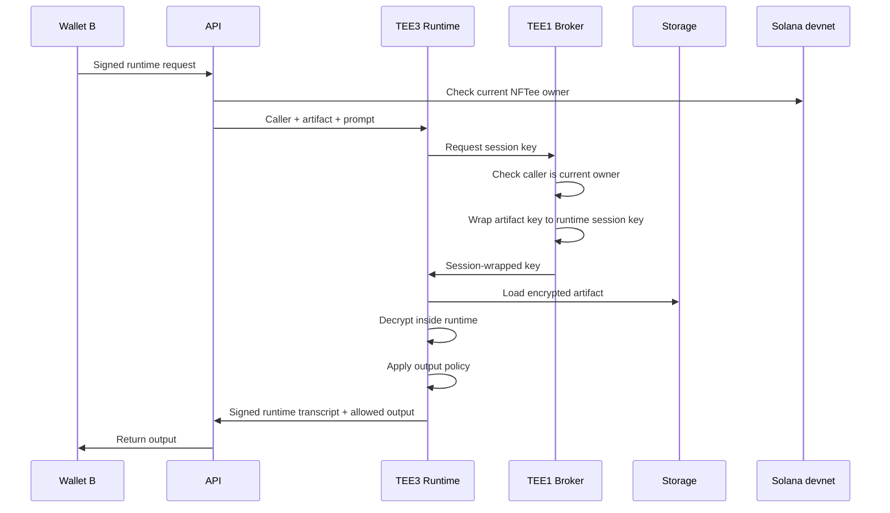
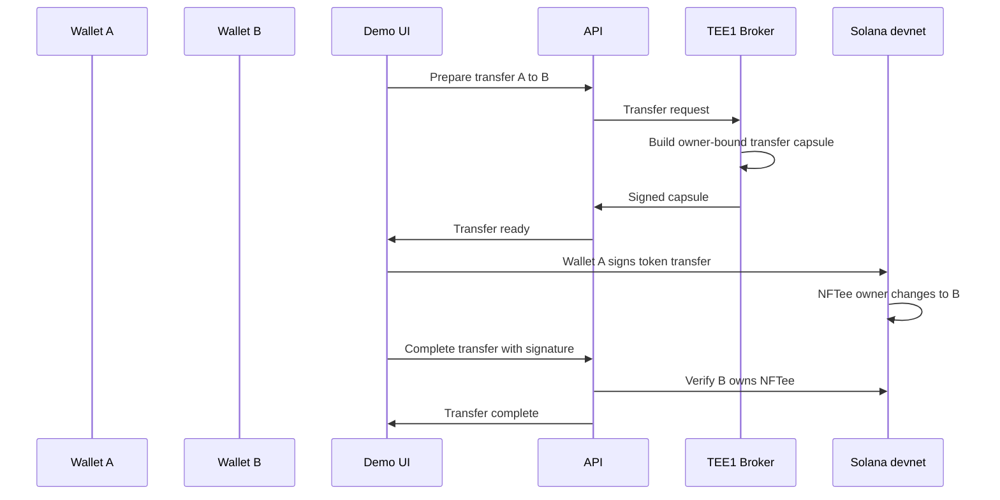

# Architecture

## Core idea

The NFTee holder owns a transferable control right.

The holder does not receive:

- the raw artifact,
- the raw symmetric key,
- or the plaintext animal name.

Only an approved runtime can use the secret internally.

## Roles

### TEE1 — Broker TEE

The broker controls access to the artifact key.

It checks owner-bound transfer/access capsules and releases short-lived wrapped keys to approved runtimes.

### TEE2 — Creator TEE

The creator generates the scarce artifact.

For the MVP, the artifact is a hidden animal plus a random trait and seed.

### TEE3 — Runtime TEE

The runtime answers one approved question:

> What sound does this animal make?

It can return `quack`, `woof`, `moo`, and similar outputs. It cannot return the raw artifact.

## System overview

## Creation flow

## Access flow

## Transfer flow

## Why this MVP uses mock attestation

Real TEE quote verification is not a small UI feature. It needs hardware, certificates, quote verification, freshness checks, and usually a registry.

This repo models the correct shape:

- every TEE has a public key,
- every TEE has a measurement,
- every TEE produces an attestation object,
- every important action is signed,
- and every transcript binds to the artifact, wallet, NFTee, nonce, and epoch.

The roadmap replaces mock attestation with Automata DCAP and zkVM-compressed attestation.
